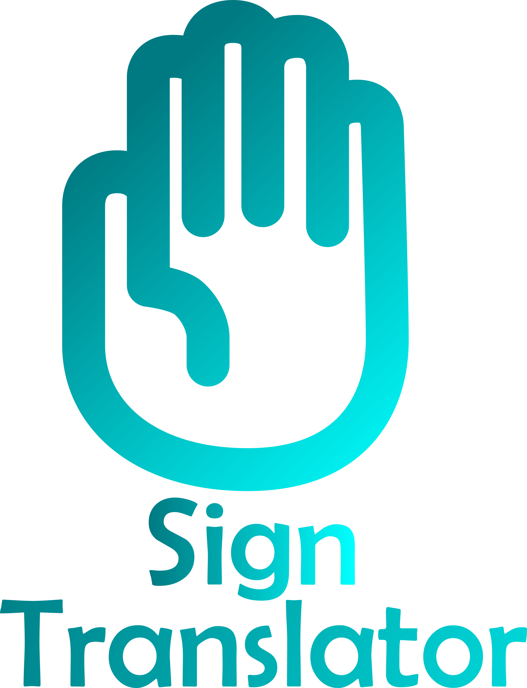

<a name="readme-top"></a>

<br />
<div align="center">
  <a href="https://github.com/AbimaelFranco/SignTranslator">
    
  </a>

  <h3 align="center">Sign Translator</h3>

  <p align="center">
    Use computer vision to convert signs into text and audio in real-time.
    
  </p>
</div>


## About The Project

[![Product Name Screen Shot][product-screenshot]]([https://example.com](https://github.com/AbimaelFranco/SignTranslator))

This project aims to create a useful tool for individuals with verbal impairments who communicate through sign language. This tool facilitates communication with people who are unfamiliar with sign language. Leveraging the power of real-time image processing and computer vision, this prototype translates sign language into text and speech.

The system utilizes the device's camera to capture the user's hand movements in real-time. By employing MediaPipe and OpenCV, the captured image is processed to identify key reference points on the visible hand. These points are then compared against a pre-trained model that contains the desired signs. The system determines the closest matching sign from the model and displays the corresponding letter on the video feed. If the detected sign is held for a specified duration, the system saves the character and waits for the next input. Once no hand is detected, the system compiles the saved characters into a text file and generates an audio output of the translated message.

Key features of the project include:

- **Real-Time Sign Detection**: Utilizes the device's camera to capture hand movements and translates them into text.
- **Computer Vision and AI Integration**: Employs MediaPipe and OpenCV for hand tracking and sign recognition.
- **Customizable Sign Model**: The signs to be detected can be modified, allowing for adaptability and improvement over time.
- **Text and Audio Output**: Converts recognized signs into text, and subsequently, into speech, enhancing communication accessibility.

Please note that this project is currently a prototype. While it effectively demonstrates the concept and functionality, further development and refinement are necessary for broader application. The set of detectable signs can be expanded or altered based on user needs and additional training data.


### Built With

This section should list any major frameworks/libraries used to bootstrap your project. Leave any add-ons/plugins for the acknowledgements section. Here are a few examples.
* [![Python][Python.js]][Python-url]
* [![OpenCV][OpenCV.js]][OpenCV-url]

<!-- GETTING STARTED -->
## Getting Started

This section will guide you through the setup and usage of the "Sign Translator" project. The project is developed using Python 3.8.10 and contains all necessary dependencies and scripts within the repository. You can access the repository at the following link: [SignTranslator](https://github.com/AbimaelFranco/SignTranslator)

### Prerequisites

This is an example of how to list things you need to use the software and how to install them.
* Python 3.8.10
* Git

### Installation

1. Clone the Repository
   ```sh
   git clone https://github.com/AbimaelFranco/SignTranslator.git
   cd SignTranslator
   ```
2. Set Up the Virtual Environment
   ```sh
   python3 -m venv venv
   source venv/bin/activate  # On Windows, use `venv\Scripts\activate`
   ```
3. Install Dependencies
   ```sh
   pip install -r requirements.txt
   ```

### Project Structure

The project consists of four main scripts:

1. `collect_imgs.py`: Captures images for model creation.

    * This script opens a camera window and starts capturing 100 images of the current sign when the 'q' key is pressed. It stores the images in the *data* folder.
    * The number of signs the model can interpret is defined by the *number_of_classes* variable.

2. `create_dataset.py`: Processes captured images and establishes reference points.

    * This script processes all images in the *data* folder and creates a file called *data.pickle* containing the reference points for each image.

3. `train_classifier.py`: Trains the model using the processed dataset.

    * This script reads the *data.pickle* file and trains a classifier, generating a model file *model.p*.
    * It also outputs the classification accuracy.

4. `inference_classifier.py`: Activates the camera and performs real-time sign recognition.

    * This script uses the trained model to recognize signs in real-time.
    * It displays the detected sign over the video feed and includes a progress bar for saving the recognized sign.
    * If no sign is detected for 3 seconds, it saves a space character. After another 3 seconds of inactivity, it adds a period and eventually closes, executing audio output of the saved text.   

<!-- USAGE EXAMPLES -->
## Usage

1. Run the `collect_imgs.py` script to start capturing images for each sign:
   ```sh
   python collect_imgs.py
   ```
2. Process the captured images and create the dataset by running:
   ```sh
   python create_dataset.py
   ```
3. Generate the model by running:
   ```sh
   python train_classifier.py
   ```
4. Start the real-time sign detection and translation:
   ```sh
   python inference_classifier.py
   ```

<!-- LICENSE -->
## License

Distributed under the MIT License. See `LICENSE.txt` for more information.


[product-screenshot]: Pictures/Señas.png

[Python.js]: https://img.shields.io/badge/python-3670A0?style=for-the-badge&logo=python&logoColor=ffdd54
[Python-url]: https://www.python.org/
[OpenCV.js]: https://img.shields.io/badge/OpenCV-27338e?style=for-the-badge&logo=OpenCV&logoColor=white
[OpenCV-url]: https://opencv.org/
